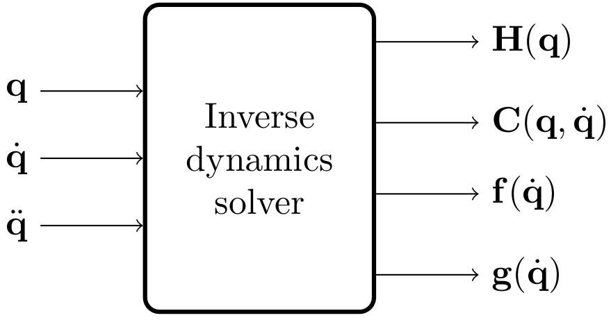

# inverse_dynamics_solver

This package provides a superclass for a generic inverse dynamics solver.

Given a dynamic model in the form `H(q) * ddq + C(q,dq) * dq + f(dq) + g(q) = tau`, this library can return the following values:

* **getInertiaMatrix(q)** returns the inertia matrix `H(q)`, as a function of joint positions `q`;
* **getCoriolisVector(q)** returns the Coriolis and centrifugal effects vector `C(q,dq) * dq`, as a function of joint positions `q` and velocities `dq`;
* **getGravityVector(q)** returns the gravity vector `g(q)`, as a function of joint positions `q`;
* **getFrictionVector(dq)** returns the possibly nonlinear friction vector `f(dq)`, as a function of joint velocities `dq`;
* **getDynamicParameters(q, dq)** returns the tuple (`H(q)`, `C(q,dq)`, `g(q)`);
* **getTorques(q, dq, ddq)** returns `H(q) * ddq + C(q,dq) * dq + g(q)`.

Please check the [InverseDynamicsSolver](./include/inverse_dynamics_solver/inverse_dynamics_solver.h) class for more information.

Demos and tests are available with concrete implementations of this library: please check [InverseDynamicsSolverKDL](../kdl_inverse_dynamics_solver/README.md) or [InverseDynamicsSolverUR10](../ur10_inverse_dynamics_solver/README.md).
